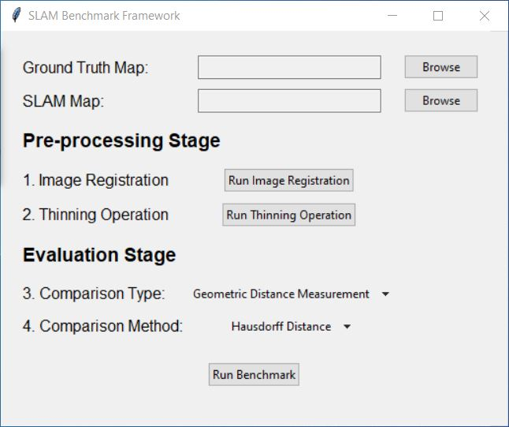

# SLAM Benchmark Framework

## Overview

The SLAM Benchmark Framework is designed for evaluating 2D SLAM maps by comparing them with ground truth maps. This framework consists of pre-processing and evaluation stages, allowing users to assess the accuracy of various 2D SLAM algorithms.


## Features

- **Pre-processing Stage:**
  - Image Registration
  - Thinning Operation

- **Evaluation Stage:**
  - Image Similarity
  - Geometric Distance Measurement
  - Correspondence Matching

## Getting Started

### Prerequisites

- Python 3.x

### Installation

1. Clone the repository:

   ```bash
   git clone https://github.com/your-username/slam-benchmark-framework.git

2. Install dependencies:

    ```bash
    pip install -r requirements.txt

3. Usage

    Run the main UI script:

    ```bash
    python main_ui.py

Use the UI to select the ground truth map and SLAM map.

Follow the steps in the Pre-processing and Evaluation stages as needed.

Click "Run Benchmark" to initiate the benchmarking process.

4. File Structure

    main_ui.py: The main script for the graphical user interface.
    benchmark_logic.py: Contains the logic for image registration, thinning operation, and benchmarking.
    utils.py: Utility functions used in the project.
    ...

5. Contributing

Contributions are welcome! If you find any issues or have suggestions, please open an issue or create a pull request.

6. License

This project is licensed under the MIT License.

7. Contact

For inquiries, please contact `riadh.dhaoui@rub.de`
